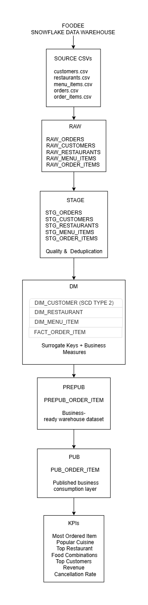

# FOODEE — Snowflake Food Delivery Data Warehouse

FOODEE is an end-to-end **Snowflake data warehouse project** built around a food delivery business. The project transforms raw CSV source data into structured, analytics-ready datasets and business KPIs using SQL and a layered warehouse architecture.

## Architecture



The warehouse follows a layered approach to separate raw ingestion, data preparation, dimensional modeling, publication, and business reporting.

## Tech Stack

* Snowflake
* SQL
* Git / GitHub
* CSV

## Data Sources

FOODEE uses the following source datasets:

* Customers
* Restaurants
* Menu Items
* Orders
* Order Items

## Warehouse Layers

### RAW

Stores source data with minimal transformation while preserving the source structure.

### STAGE

Cleans and prepares source data for downstream processing, including data-quality and deduplication rules.

### DM — Data Mart

Contains the core dimensional model:

* Customer dimension
* Restaurant dimension
* Menu item dimension
* Order item fact

Customer history is handled using **SCD Type 2** to preserve historical versions of customer attributes.

### PREPUB

Provides an intermediate, business-ready representation of the dimensional data before final publication.

### PUB

Contains datasets prepared for business consumption and reporting.

## Data Modeling

The project uses a dimensional modeling approach with:

* Dimension tables for descriptive business entities
* A fact table at **order-item grain**
* Surrogate keys for warehouse dimensions
* SCD Type 2 for customer history

The `FACT_ORDER_ITEM` table stores measures such as:

* Quantity
* Unit price
* Discount amount
* Gross amount
* Net amount

## Reload-Safe Fact Loading

The fact pipeline uses `MERGE` logic to make the load **idempotent**.

Existing order-item records are matched using `ORDER_ITEM_ID`, preventing duplicate fact records when the pipeline is rerun.

Order status history is also handled using the latest `LAST_UPDATED_TIMESTAMP` so that downstream tables use the current order state.

## Business KPIs

FOODEE includes SQL-based reporting for:

1. Most ordered food item
2. Most popular cuisine
3. Most ordered restaurant
4. Popular food combinations
5. Top customers by order activity
6. Revenue by restaurant
7. Customer cancellation rate

## Data Quality

The project includes validation checks for:

* Duplicate records
* NULL values in critical fields
* Orphaned dimension keys
* SCD Type 2 consistency
* Fact-table integrity
* Layer-level data validation

## Repository Structure

```text
foodee-snowflake-datawarehouse/
│
├── data/
│   ├── customers.csv
│   ├── menu_items.csv
│   ├── order_items.csv
│   ├── orders.csv
│   └── restaurants.csv
│
├── docs/
│   └── architecture.png
│
├── sql/
│   ├── setup/
│   ├── raw/
│   ├── stage/
│   ├── dm/
│   ├── prepub/
│   ├── pub/
│   └── reports/
│
└── README.md
```

## How to Run

1. Create the Snowflake warehouse, database, schemas, file format, and internal stage using the scripts in `sql/setup/`.
2. Load the source CSV files into the RAW layer.
3. Run the STAGE transformation and data-quality scripts.
4. Build and load the DM dimensions and fact table.
5. Run the PREPUB and PUB layers.
6. Execute the reporting scripts in `sql/reports/`.

## Project Objective

The goal of FOODEE is to demonstrate practical **data engineering and Snowflake data warehousing concepts**, including layered architecture, dimensional modeling, SCD Type 2, SQL transformations, data quality, idempotent loading, and business-oriented analytics.
